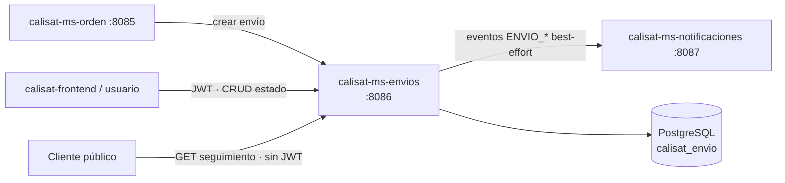

# calisat-ms-envios

> Microservicio Spring Boot de envíos: creación de guías (CAL-…), máquina de estados con historial *append-only* y seguimiento público por número de guía.


**Versión actual: `2.0.0`** (definida en `pom.xml` · historial en [`CHANGELOG.md`](CHANGELOG.md))

---

## 📑 Índice

- [📋 Descripción general](#-descripción-general)
- [✨ Características principales](#-características-principales)
- [🏗️ Arquitectura](#-arquitectura)
- [🚀 Requisitos](#-requisitos)
- [⚙️ Configuración](#-configuración)
- [▶️ Ejecución local](#-ejecución-local)
- [📡 Endpoints principales](#-endpoints-principales)
- [🗃️ Modelo de datos](#-modelo-de-datos)
- [🔒 Seguridad](#-seguridad)
- [🧪 Tests](#-tests)
- [📦 Despliegue](#-despliegue)
- [🔗 Microservicios relacionados](#-microservicios-relacionados)
- [📄 Licencia y modo académico](#-licencia-y-modo-académico)

---

## 📋 Descripción general

**calisat-ms-envios** gestiona el **ciclo de vida de los envíos** de la plataforma Calisat. Al crear un envío para una orden se genera un **número de guía único** con prefijo `CAL-` (p. ej. `CAL-9F2B41C7A0D3`) y se registra el evento inicial en el historial.

Cada cambio de estado valida una **máquina de transiciones** (no se permite retroceder) y appenda un evento en la tabla de historial (*append-only*). El **seguimiento público** por número de guía está disponible **sin JWT**, para que el destinatario final pueda consultar el estado del paquete.

Desde la **v2.0.0**, los hitos `DESPACHADO` y `ENTREGADO` publican eventos hacia **calisat-ms-notificaciones** (operación best-effort con `Idempotency-Key`).

## ✨ Características principales

- 📮 **Número de guía único** con prefijo `CAL-` generado en la creación.
- 🔁 **Máquina de estados** con transiciones validadas: `CREADO → EN_PREPARACION → DESPACHADO → EN_TRANSITO → ENTREGADO`, con `FALLIDO` y `DEVUELTO`; retroceso ilegal → `409`.
- 📜 **Historial *append-only***: cada cambio de estado appenda un `EnvioEvento` con descripción y ubicación opcionales.
- 🌐 **Seguimiento público** por número de guía (sin autenticación).
- 📇 **Snapshot de dirección** (calle, ciudad, país, CP) persistido en el envío.
- 🧭 **Fechas de hito**: despacho, entrega estimada y entrega real según el estado.
- 🔔 **Publicación de eventos** `ENVIO_DESPACHADO` / `ENVIO_ENTREGADO` hacia notificaciones con `Idempotency-Key` (v2, best-effort).
- 📕 **OpenAPI 3 + Swagger UI** · 🩺 **Actuator** · 🐳 **Docker multi-stage**.
- 🧪 **13 tests** (servicio + cliente de notificaciones mockeado).

## 🏗️ Arquitectura



### Estructura de paquetes

```
com.calisat.msenvios
├── client/        # NotificacionesClient (RestTemplate)
├── config/        # SecurityConfig, RestTemplateConfig, CORS
├── controller/    # EnvioController
├── dto/           # EnvioRequest, EnvioResponse, EnvioEstadoRequest, SeguimientoResponse
├── exception/     # GlobalExceptionHandler, TransicionEstadoNoPermitidaException, ...
├── model/         # Envio, EnvioEvento, EstadoEnvio (JPA)
├── repository/    # EnvioRepository, EnvioEventoRepository
└── service/       # EnvioService (@Transactional, máquina de estados)
```

## 🚀 Requisitos

| Requisito | Versión mínima |
|-----------|----------------|
| JDK | **21+** (enforcer) |
| Maven | 3.6.3+ (o wrapper `./mvnw`) |
| Docker + Docker Compose | 24+ |
| Servicio opcional | `calisat-ms-notificaciones` (:8087) para publicación de eventos |

## ⚙️ Configuración

Valores de `src/main/resources/application.yaml`, `docker-compose.yml` y variables de cliente:

| Parámetro | Valor |
|-----------|-------|
| **Puerto del servicio** | **`8086`** (`application.yaml`; Compose publica `8086:8080` con `SERVER_PORT=8080` en contenedor) |
| Base de datos | PostgreSQL · `calisat_envio` |
| Host de BD (local) | `localhost:5434` (según `application.yaml`) |
| Usuario / contraseña BD | `postgres` / `postgres` *(solo académico)* |
| `ddl-auto` | `update` |
| JWT *issuer* | `https://login.microsoftonline.com/e5372bf0-c5e3-4286-887c-79069f209c1f/v2.0` |
| JWT *audience* | `d221f0d2-1a7c-4872-ad6c-367a1f0717ec` |
| Rutas públicas | `GET /api/v1/envios/seguimiento/**`, `/actuator/health`, Swagger UI |

### Variables de integración (cliente)

| Variable | Defecto | Servicio consumido |
|----------|---------|--------------------|
| `CALISAT_NOTIFICACIONES_URL` | `http://localhost:8087` | `calisat-ms-notificaciones` |

> ⚠️ **Modo académico**: issuer, audience y credenciales están **hardcodeados**; en producción deben externalizarse. Sin service discovery: URL por variable de entorno.

## ▶️ Ejecución local

### 1. Base de datos

```bash
docker compose up -d postgres-db
```

### 2. Aplicación

```bash
# Windows
mvnw.cmd spring-boot:run

# Linux / macOS
./mvnw spring-boot:run
```

### 3. Docker Compose

```bash
docker compose up --build
```

Servicio en `http://localhost:8086` (Swagger: `/swagger-ui.html`).

## 📡 Endpoints principales

Base: `http://localhost:8086/api/v1/envios`

| Método | Ruta | Descripción | Auth |
|--------|------|-------------|------|
| `POST` | `/api/v1/envios` | Crear envío para una orden (`201` + `Location`; genera guía `CAL-…`; 409 si la orden ya tiene envío) | JWT |
| `GET` | `/api/v1/envios` | Listar envíos (por `ordenId` o los del usuario del JWT) | JWT |
| `GET` | `/api/v1/envios/{id}` | Detalle de envío por id (404 si no existe) | JWT |
| `PUT` | `/api/v1/envios/{id}/estado` | Cambiar estado y appendar evento (404 · 409 transición ilegal · 400 estado desconocido) | JWT |
| `GET` | `/api/v1/envios/seguimiento/{numeroGuia}` | **Seguimiento público**: estado + historial de eventos | **Pública** |

**Total: 5 endpoints** · *Swagger UI*: `/swagger-ui.html`

### Máquina de estados

```
CREADO ──► EN_PREPARACION ──► DESPACHADO ──► EN_TRANSITO ──► ENTREGADO
   │              │                │              │
   └──────────────┴────────────────┴──────────────┴──► FALLIDO ──► DEVUELTO
                                                       
   ENTREGADO y DEVUELTO = estados terminales (sin transiciones de salida)
```

- `EN_PREPARACION`/`DESPACHADO` fijan la fecha de despacho; `ENTREGADO` fija la fecha de entrega real.
- Retroceso (p. ej. `ENTREGADO → CREADO`) → `409`.

### Ejemplo

```bash
# Seguimiento público (sin token)
curl http://localhost:8086/api/v1/envios/seguimiento/CAL-9F2B41C7A0D3

# Crear envío para una orden
curl -X POST http://localhost:8086/api/v1/envios \
  -H "Authorization: Bearer $TOKEN" \
  -H "Content-Type: application/json" \
  -d '{
        "ordenId":"3f1c…",
        "direccionCalle":"Av. Siempreviva 742",
        "direccionCiudad":"Springfield",
        "direccionPais":"US",
        "direccionCodigoPostal":"97402",
        "transportista":"Estafeta"
      }'
```

## 🗃️ Modelo de datos

### Entidad `Envio` (tabla `envio`)

| Campo | Tipo | Restricciones |
|-------|------|---------------|
| `id` | `UUID` | PK |
| `orden_id` | `UUID` | `NOT NULL` · índice `idx_envio_orden_id` |
| `usuario_sub` | `String(128)` | Índice `idx_envio_usuario_sub` |
| `numero_guia` | `String(32)` | **Único**, `NOT NULL` — prefijo `CAL-` |
| `transportista` | `String(120)` | Opcional |
| `estado` | `Enum` | `CREADO` (default) · ver máquina de estados |
| `direccion_calle/ciudad/pais/codigo_postal` | `String` | Snapshot de dirección |
| `fecha_creacion` | `LocalDateTime` | `@PrePersist` |
| `fecha_despacho` | `LocalDateTime` | Fijada en `EN_PREPARACION`/`DESPACHADO` |
| `fecha_entrega_estimada` / `fecha_entrega_real` | `LocalDateTime` | Estimada / real (`ENTREGADO`) |
| `fecha_actualizacion` | `LocalDateTime` | `@PrePersist` / `@PreUpdate` |

### `EnvioEvento` · `EstadoEnvio`

- `EnvioEvento`: historial **append-only** del tracking (estado, descripción, ubicación, fecha).
- `EstadoEnvio`: `CREADO`, `EN_PREPARACION`, `DESPACHADO`, `EN_TRANSITO`, `ENTREGADO`, `FALLIDO`, `DEVUELTO`.

## 🔒 Seguridad

- **JWT (OAuth2 Resource Server)** de **Microsoft Entra ID**: validación de *issuer* + *audience*.
- **Sin RBAC**: un único nivel autenticado (*modo académico, usuario genérico*).
- **Rutas públicas**: `GET /api/v1/envios/seguimiento/**` (seguimiento por guía), `GET /actuator/health` y Swagger UI.
- **CSRF deshabilitado** · **CORS** restringido al origen del despliegue.

## 🧪 Tests

```bash
./mvnw test
```

| Suite | Archivos | Tests |
|-------|----------|-------|
| Unitarios | `EnvioServiceTest` (11), `NotificacionesClientTest` (2) | **13** |

> El POM configura **Failsafe** para tests de integración `*IT.java` con Testcontainers (PostgreSQL real), ligados a `./mvnw verify`.

## 📦 Despliegue

### Docker

```bash
docker build -t calisat-ms-envios:2.0.0 .
docker run -p 8086:8080 --name calisat-ms-envios calisat-ms-envios:2.0.0
```

**Dockerfile multi-stage:**

1. `maven` (Temurin 21) → `mvn clean package`.
2. `eclipse-temurin:21-jre-alpine` → JAR con usuario no root, `MaxRAMPercentage=75`, `HEALTHCHECK` en `/actuator/health`.

### Docker Compose

```bash
docker compose up --build
```

Levanta PostgreSQL 15 (`calisat_envio`) + app en **8086** (red `calisat-net`).

## 🔗 Microservicios relacionados

| Repositorio | Relación |
|-------------|----------|
| [calisat-ms-orden](https://github.com/DavNat13/calisat-ms-orden) | **Productor**: crea el envío al preparar/despachar la orden (`CALISAT_ENVIOS_URL`, `:8086`) |
| [calisat-ms-notificaciones](https://github.com/DavNat13/calisat-ms-notificaciones) | **Dependencia**: recibe eventos `ENVIO_DESPACHADO`/`ENVIO_ENTREGADO` (`CALISAT_NOTIFICACIONES_URL`, `:8087`) |
| [calisat-ms-carrito](https://github.com/DavNat13/calisat-ms-carrito) | Carrito de compras (puerto 8084) |
| [calisat-ms-inventario](https://github.com/DavNat13/calisat-ms-inventario) | Stock y reservas (puerto 8083) |
| [calisat-ms-catalogo](https://github.com/DavNat13/calisat-ms-catalogo) | Catálogo de productos (puerto 8082) |
| [calisat-ms-usuarios](https://github.com/DavNat13/calisat-ms-usuarios) | Perfil y direcciones (puerto 8081) |
| [calisat-frontend](https://github.com/DavNat13/calisat-frontend) | SPA React 19 (v1.4.0) |

## 📄 Licencia y modo académico

Proyecto desarrollado en **modo académico**; sin licencia open source formal. Issuer, audience y credenciales están *hardcodeados* con fines educativos; sin RBAC (usuario genérico autenticado) y sin service discovery (URLs por variables de entorno).

- **Versión actual**: `2.0.0` — *breaking change*: `EnvioService` ahora inyecta `NotificacionesClient`
- **Historial de cambios**: [`CHANGELOG.md`](CHANGELOG.md)
